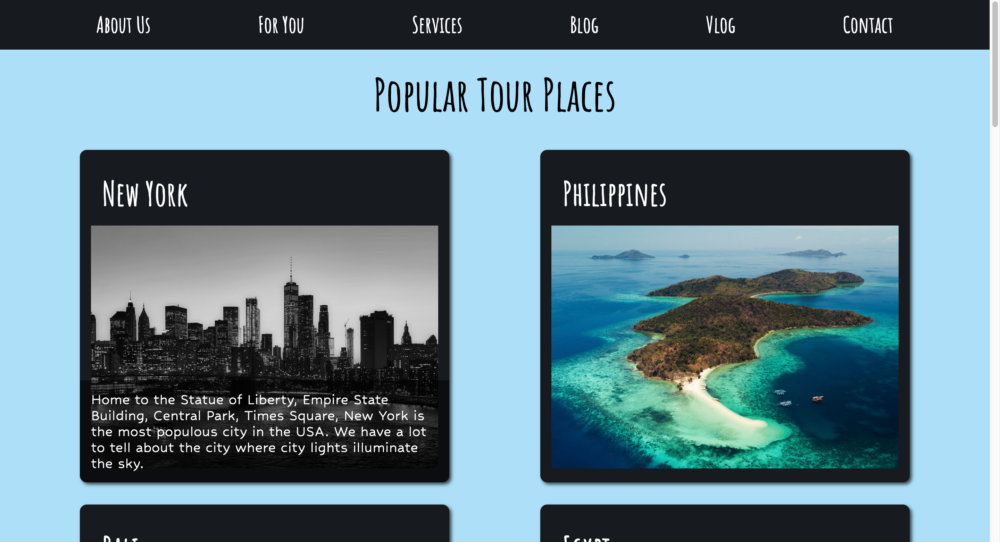

# First React App

This is an application that the first time I use React.js

## Table of contents

- [Overview](#overview)
  - [Screenshot](#screenshot)
  - [Links](#links)
- [My process](#my-process)
  - [Built with](#built-with)
  - [What I learned](#what-i-learned)
  - [Continued development](#continued-development)
- [Author](#author)

## Overview

### Screenshot



### Links

- Live Site URL: [Live Site](https://tourplaces-react.netlify.app/)

## My process

### Built with

- CSS custom properties
- Flexbox
- Sass-CSS preprocessor
- Responsive Design
- React.js Basics

### What I learned

I learned essential parts of responsive design at this challenge.Also I reinforced some konowledge about CSS.
Apart from these I reviewed React.js basics ans Sass variables and essentials.
To see how you can add code snippets, see below:

- HTML

```html
<body>
  <div id="root"></div>
  <script type="module" src="/src/main.jsx"></script>
</body>
```

- Sass/Scss

```scss
@import './reset', './variables';

body {
  background-color: $backgrounColor;
  font-family: 'Segoe UI', Tahoma, Geneva, Verdana, sans-serif;

  .container {
    display: flex;
    flex-direction: column;
    justify-content: center;
    align-items: center;
    margin: 2rem;
    }
```

- JSX

```jsx
import React from 'react';

export default function Card(data) {
  const { id, title, image, desc } = data;
  return (
    <div className="cards">
      <div className="title">
        <h1>{title}</h1>
      </div>
      
      <div className="card-over">
        <p>{desc}</p>
      </div>
    </div>
  );
}
```

### Continued development

- Responsive Design
- Sass
- React

### Useful resources

- [React Documentation](https://react.dev/)
- [Sass Basics](https://sass-lang.com/guide/)

## Author

- Github - [morcicek](https://github.com/morcicek)
- Linkedin - [Mehmet Cevat Morcicek](https://linkedin.com/in/mehmet-cevat-morcicek-b50a29178)
- Twitter - [@morcicek_m](https://twitter.com/morcicek_m)
